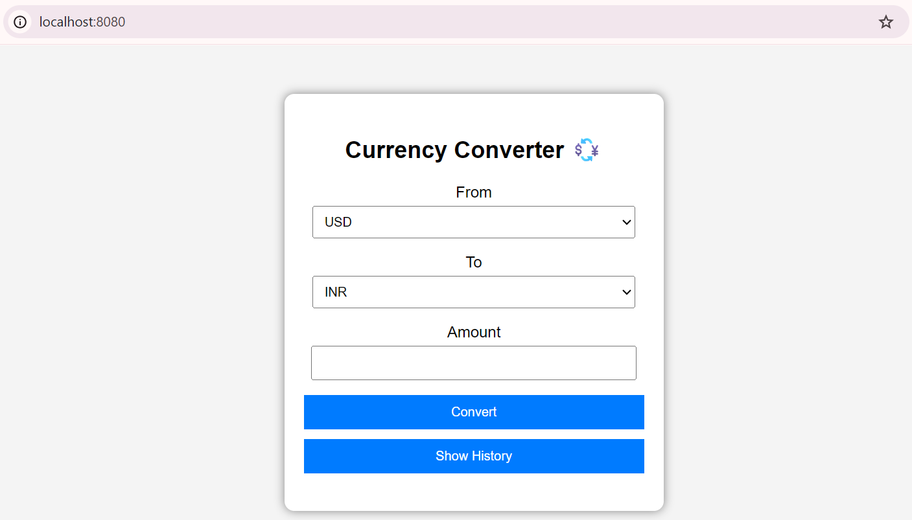
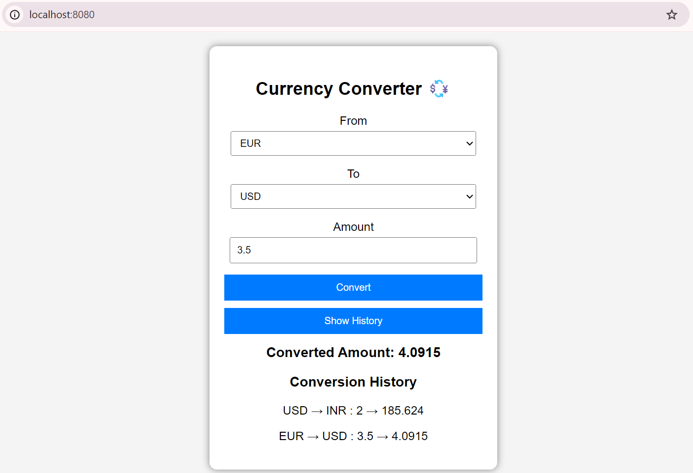

# 💱 Currency Converter

## Overview

This is a full-stack Currency Converter application built using **Spring Boot** and a simple **HTML/CSS/JavaScript frontend**.

It allows users to:

* Convert currencies in real-time
* View past conversion history
* Interact through a clean UI

---

## Tech Stack

### Backend

* Java 25
* Spring Boot
* REST APIs
* Spring Data JPA
* H2 Database

### Frontend

* HTML
* CSS
* JavaScript (Fetch API)

### External API

*  [ExchangeRate API](https://www.exchangerate-api.com/) (real-time currency rates)

---

## Features

* API Key Authentication
* Real-time currency conversion
* Conversion history storage (H2 DB)
* Dynamic currency dropdown
* Responsive UI (mobile-friendly)
* Clean API responses (success + data structure)

---

## How It Works

1. User selects currencies and amount from UI
2. Frontend calls backend API
3. Backend fetches live rates from external API
4. Conversion is calculated
5. Data is saved to database
6. Result is returned and displayed

---

## API Endpoints

### Convert Currency

GET /convert
Params:

* from
* to
* amount
* apiKey

---

### Get Conversion History

GET /history

---

### Get Supported Currencies

GET /currencies

---

## How to Run

1. Clone the repository
2. Open in IntelliJ / IDE
3. Run the Spring Boot application

OR

```bash
mvn clean package
java -jar target/*.jar
```

4. Open browser:

```
http://localhost:8080
```

---

## Configuration

API keys are stored in:

```
application.properties
```

---

## Screenshots

### Home Page


### Conversion History



---

## Author

@prathameshkakde

---

> ## Note
> This project idea is inspired by an [article](https://www.geeksforgeeks.org/blogs/java-projects/#:~:text=1.%20Currency%20Converter) from [GeeksforGeeks](https://www.geeksforgeeks.org/) and showcases the following key concepts:
> * Backend development
> * API integration
> * Database usage
> * Frontend interaction

---
